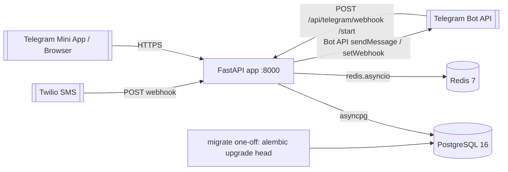
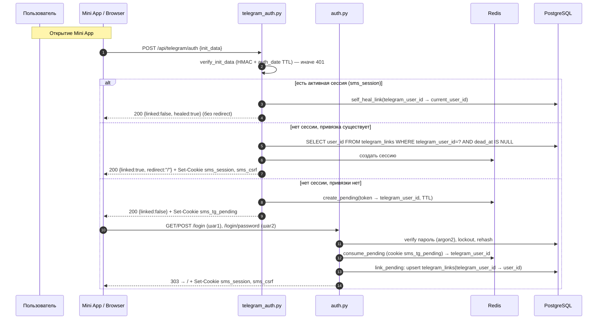
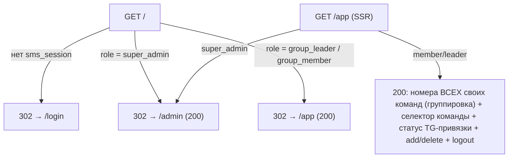

# 03. Architecture

## Обзор

Монолитное FastAPI-приложение + фоновый loop доставки внутри того же процесса. Отдельный worker-процесс не вводится (объём мал, см. NFR в [01-overview.md](./01-overview.md)). Данные — PostgreSQL, эфемерное состояние (сессии, pending-токены, rate-limit) — Redis.

## Топология развёртывания



Один бот обслуживает Mini App-логин, push-доставку и приём апдейтов через **webhook** (в отличие от нескольких ботов mail-agregator). Long polling удалён ([ADR-0005](./adr/ADR-0005-sms-addressing-via-team.md)); вместо него апдейты бота приходят на `POST /api/telegram/webhook` ([ADR-0010](./adr/ADR-0010-telegram-webhook-and-new-bot.md)). Бот обрабатывает **только `/start`** (отвечает кнопкой `web_app` на `TELEGRAM_WEBAPP_URL`); прочие апдейты — no-op. Токен бота — новый (`TELEGRAM_BOT_TOKEN`), общий для HMAC initData и `sendMessage`; webhook защищён `TELEGRAM_WEBHOOK_SECRET`.

## Пакеты и слои

```
shared/                      # переносимый инфраструктурный слой
  config.py                  # pydantic-settings Settings
  db.py                      # Base(DeclarativeBase), init_engine(role), get_session, make_session, dispose_engine
  models/                    # SQLAlchemy-модели: teams, users, user_teams (M:N членство, ADR-0012),
                             #   telegram_links, phone_numbers, inbound_sms, deliveries, admin_audit, service_state
migrations/                  # Alembic (env.py async, versions/)
app/
  api/
    deps.py                  # DbSession, current_session/current_user, VisibilityScope (team_ids — ADR-0012), guards
    cookies.py, csrf.py      # cookie-хелперы, CSRF double-submit
    middlewares.py           # CSRF, MethodOverride, Session, SecurityHeaders, RequestID
    templates.py             # Jinja2 env
    templates/               # base, login, login_password, set_password, app, admin/*, errors/*
    static/js/               # tg.js, csrf.js, admin_users.js, app.js ; static/css/main.css
    routers/
      webhooks.py            # POST /api/webhooks/twilio/sms
      auth.py                # /login, /login/password, /set-password, /logout
      telegram_auth.py       # POST /api/telegram/auth (Mini App SSO)
      telegram_webhook.py    # POST /api/telegram/webhook (только /start → web_app-кнопка; секрет-токен) — ADR-0010
      admin.py               # /api/admin/users (+ /users/{id}/teams add/remove членства — ADR-0012), /api/admin/numbers (list/allocate — ADR-0009; POST /numbers/sync on-demand Twilio-sync — ADR-0013), /api/admin/teams, /api/admin/teams/{id}/leader (set_leader)
      admin_ui.py            # GET /admin, /admin/teams (SSR)
      landing.py             # GET / (диспетчер по роли), GET /app (SSR landing участника/лидера) — ADR-0008
      numbers.py             # /api/numbers CRUD
  application/
    services.py              # SMS-пайплайн (handle_incoming_sms, deliver, retry)
    auth_service.py          # seed_admin, lookup_for_login, login, complete_set_password, logout
    admin_service.py         # create_user, reset_password, delete_user
    teams_service.py         # create/rename/delete, set_leader, «первый=лидер»
    telegram_sso_service.py  # verify_and_resolve, create/consume_pending, link_pending, self_heal_link, mark_link_dead
    workers.py               # delivery_retry_loop
  domain/
    entities.py              # Team, User, Recipient, PhoneNumber, InboundSms, Delivery, TelegramLink
    repositories.py          # async-протоколы репозиториев
  infrastructure/
    repositories.py          # реализации на AsyncSession (в т.ч. UserTeamRepository — членство, ADR-0012;
                             #   recipients_for_team/member-счётчики читают user_teams)
    sessions.py              # SessionStore + SetupSessionStore (Redis)
    rate_limit.py            # счётчики попыток/лимитов (Redis)
    redis_client.py          # redis.asyncio singleton
    telegram_api.py          # Bot API client + TelegramForbiddenError/TelegramApiError
    twilio_security.py       # RequestValidator обёртка
  core/
    security.py              # argon2 singleton (hash/verify/needs_rehash)
  telegram/
    init_data.py             # verify_init_data() — HMAC-SHA256 + auth_date TTL
scripts/
  migrate_sqlite_to_pg.py    # one-off полная миграция данных (ADR-0006)
  import_numbers.py          # one-off импорт номеров из SQLite как unassigned (ADR-0009)
  sync_twilio_numbers.py     # one-off/CLI on-demand sync входящих номеров Twilio-аккаунта как unassigned (ADR-0013; общий механизм с POST /api/admin/numbers/sync)
```

## Порядок middleware

Регистрируются в `create_app` в обратном порядке (`app.add_middleware` добавляет наружу), итоговая цепочка обработки запроса:

```
CSRF → MethodOverride → Session → SecurityHeaders → RequestID
```

- **RequestID** (внутренний) — присваивает `X-Request-ID`, кладёт в `request.state` и логи.
- **SecurityHeaders** — CSP, `X-Content-Type-Options`, `Referrer-Policy` и др. (см. [08-security.md](./08-security.md)).
- **Session** — читает cookie `sms_session`, резолвит сессию из Redis в `request.state.session`.
- **MethodOverride** — поддержка `_method=DELETE/PATCH` из HTML-форм (SSR без JS-фетча).
- **CSRF** (внешний) — проверка double-submit токена для небезопасных методов; endpoints `/api/webhooks/twilio/sms`, `/api/telegram/auth`, `/api/telegram/webhook` — в exempt-списке (защита — подпись Twilio / HMAC initData / секрет-токен вебхука).

## Доступ к БД и сессии

- `shared/db.py`: `Base(DeclarativeBase)`, `init_engine(role)` создаёт async engine с пулом по роли (`api`: pool_size=10, max_overflow=20; `worker`: 5/5), `pool_pre_ping=True`. `get_session()` — dependency (FastAPI `Depends`), `make_session()` — контекстный менеджер для фоновых задач/скриптов. `dispose_engine()` в shutdown.
- Webhook-обработчик выполняет одну сессию/транзакцию на запрос.
- Циклический FK `teams.leader_user_id ↔ users.team_id` разрешается через `users.team_id DEFERRABLE INITIALLY DEFERRED` (проверка откладывается до COMMIT) — см. [04-data-model.md](./04-data-model.md).

### Работа с транзакциями и autobegin (нормативно)

Session factory сконфигурирована с `expire_on_commit=False`, поэтому ORM-атрибуты остаются доступны **после** `commit()` (не требуют повторной загрузки). SQLAlchemy работает в режиме **autobegin**: первый же `SELECT` (read) неявно открывает read-транзакцию. Эту транзакцию **обязательно закрыть** (`await session.commit()`) перед началом явного write-блока `async with session.begin()`, иначе — `InvalidRequestError: A transaction is already begun`.

Правило: если после read-запроса нужен write-блок в той же сессии — сначала `commit()` read-транзакции, затем `session.begin()`.

```python
number = await phones.find_by_phone(to)      # autobegin: открыл read-tx
await session.commit()                        # ОБЯЗАТЕЛЬНО: закрыть read-tx
async with session.begin():                   # чистый write-блок
    sms = await messages.create(...)
```

Паттерн уже применён в `app/api/deps.py::current_user`, `app/application/services.py` (`handle_incoming_sms`, `retry_pending_deliveries`), `app/api/routers/numbers.py`. Исполнители обязаны следовать ему во всех местах, где read-SELECT предшествует `session.begin()` (первопричина устранённого класса бага — см. [100-known-tech-debt.md](./100-known-tech-debt.md)).

### Multi-team: членство, scope и адресация (нормативно, [ADR-0012](./adr/ADR-0012-multi-team-membership.md))

Аддитивная M:N `user_teams` — источник истины членства. `users.team_id` остаётся **домашней** командой (инвариант лидера, «первый=лидер», дефолт команды при добавлении номера).

- **`VisibilityScope.team_ids: frozenset[int]`.** Помимо домашней команды, scope несёт **множество** всех команд участника (home ∪ доп. членства). Построение scope (`current_scope`/`build_scope` в `deps.py`) читает `UserTeamRepository.list_team_ids_for_user(user_id)`. `super_admin` → `team_ids` пуст (видит всё вне scope-фильтра). Read-SELECT членств выполняется в autobegin read-транзакции — её обязательно закрыть `await session.commit()` перед последующим write-блоком (паттерн «Работа с транзакциями и autobegin» выше).
- **Адресация SMS.** `recipients_for_team(team_id)` фильтрует участников через `EXISTS/JOIN user_teams` (`ut.user_id = users.id AND ut.team_id = :team_id`) + живую `telegram_links` — вместо `users.team_id = :team_id`. Участник нескольких команд получает SMS каждой своей команды; `handle_incoming_sms` не меняется.
- **Видимость номеров в `/app` и `GET /api/numbers` (участник).** Фильтр — `phone_numbers.team_id = ANY(scope.team_ids)` (номера всех своих команд), а не только домашней. Добавление номера (`POST /api/numbers`) — `team_id` обязан ∈ `scope.team_ids` (участник выбирает команду из своих; иначе `403 forbidden`); при отсутствии выбора дефолт — домашняя команда.
- **Ревокация сессий при изменении членства.** Любая мутация членства (add/remove/move home) вызывает `SessionStore.revoke_all_for_user(target_user_id)` — иначе `team_ids` в активной сессии останется stale и участник увидит устаревший набор команд. После ревокации scope перечитывается при следующем входе.
- **Две разные семантики счёта — не смешивать.** Membership-семантика читает `user_teams` (home ∪ доп.), home-семантика читает `users.team_id`. Выбор зависит от назначения: отображение/адресация → membership; guard инварианта лидера → home.
  - **Membership-счётчики/списки** (`member_counts`, `list_by_team`, `list_user_ids_in_team`, `count_in_team`) читают `user_teams` — **включают** доп.-участников. Назначение: **ОТОБРАЖЕНИЕ** (`grouped_dashboard`, чипы/бейджи состава на `/admin` и `/app`) и **АДРЕСАЦИЯ SMS** (`recipients_for_team`, ревок доп.-членов при удалении команды — [ADR-0012](./adr/ADR-0012-multi-team-membership.md) §6). Здесь доп.-участник другой home-команды **обязан** учитываться.
  - **Guard'ы ИНВАРИАНТА лидера** (лидер непустой команды в `delete_user`/move-`team` [05 §4](./05-api-contracts.md), disband-gate `DELETE /api/admin/teams/{id}` [05 §5](./05-api-contracts.md)) используют **HOME-семантику** — `count_home_members` (`users.team_id == team`), **НЕ** membership-счётчики. Инвариант роль↔team и лидерство привязаны к home (`users.team_id`, [ADR-0003](./adr/ADR-0003-roles-and-teams.md) §6, [ADR-0012](./adr/ADR-0012-multi-team-membership.md) §5), поэтому доп.-участник другой home-команды **НЕ** блокирует удаление/перенос лидера и **НЕ** участвует в disband-gate (gate = home-пустота, [05 §5](./05-api-contracts.md)). Применение membership-счётчика к этим guard'ам — дефект (ложный `409 user_is_leader`/`leader_move_forbidden`/`team_has_members`).

## Поток приёма и рассылки SMS

```mermaid
sequenceDiagram
    autonumber
    participant TW as Twilio
    participant WH as webhooks.py
    participant SVC as services.handle_incoming_sms
    participant DB as PostgreSQL
    participant TG as Telegram Bot API

    TW->>WH: POST /api/webhooks/twilio/sms (form-urlencoded)
    WH->>WH: validate_twilio_signature (если VERIFY_TWILIO_SIGNATURE)
    WH->>SVC: handle_incoming_sms(sid, from, to, body, raw)
    SVC->>SVC: normalize_phone(to/from)
    SVC->>DB: PhoneNumberRepository.find_by_phone(to)
    SVC->>DB: SmsRepository.find_by_sid(sid)  (дедуп ретраев webhook)
    alt дубликат по SID
        Note over SVC: НЕ ранний возврат: переиспользуем существующий inbound_sms
        SVC->>SVC: sms = существующий (по SID), team_id = sms.team_id
    else новое
        SVC->>DB: inbound_sms.create(team_id=phone.team_id | NULL, raw_payload JSONB)
    end
    alt team_id IS NULL (неизвестный ИЛИ unassigned номер)
        SVC->>SVC: warning; SMS сохранён, доставок нет
    else team_id найден (и для нового, и для дубликата)
            SVC->>DB: UserRepository.recipients_for_team(team_id)  (JOIN user_teams членство + telegram_links dead_at IS NULL — ADR-0012)
            loop каждый получатель (user_id, telegram_user_id)
                SVC->>DB: DeliveryRepository.try_reserve(inbound_sms_id, user_id, telegram_user_id)
                Note over SVC,DB: pg_insert ON CONFLICT(inbound_sms_id, telegram_user_id) DO NOTHING RETURNING id
                alt зарезервировано (id вернулся)
                    SVC->>TG: sendMessage(telegram_user_id, format_sms_message)
                    alt успех
                        SVC->>DB: mark_sent
                    else 403 / blocked / chat not found
                        SVC->>DB: mark_dead(delivery) + telegram_links.mark_dead
                    else прочая ошибка
                        SVC->>DB: mark_failed (уйдёт в retry-loop)
                    end
                else уже доставлялось (id пустой)
                    SVC->>SVC: пропуск (идемпотентность)
                end
            end
        end
    WH-->>TW: 200 <Response></Response>
```

> **Unassigned-номер ([ADR-0009](./adr/ADR-0009-unassigned-numbers-admin-allocation.md)).** Если `find_by_phone(to)` вернул номер, но он unassigned (`team_id IS NULL`), то `inbound_sms.team_id = phone.team_id = NULL` — обработка идёт по ветке `team_id IS NULL` **идентично неизвестному номеру** (SMS сохранён, `recipients_for_team` не вызывается, доставок нет). Отдельной ветки для unassigned не вводится.

`delivery_retry_loop` (в `workers.py`) периодически берёт `status IN (pending, failed)` с `attempts < DELIVERY_MAX_ATTEMPTS`, берёт chat_id из снимка delivery, проверяет живость привязки, повторяет; 403 → dead.

### Восстановимость веерной рассылки при обрыве процесса (нормативно)

NFR «надёжность доставки» требует, чтобы fan-out был **crash-recoverable**: если процесс упал в середине рассылки (часть получателей получила SMS, часть — нет), недоставленные обязаны быть добраны без ручного вмешательства. Требуемое поведение (backend реализует, QA тестирует):

1. **Дедуп-ветка НЕ делает ранний возврат.** При повторном webhook с тем же `MessageSid` обработчик **переиспользует** существующий `inbound_sms` и всё равно проходит полный fan-out: `recipients_for_team(team_id)` → для каждого получателя `try_reserve` + отправка. Уже доставленные отсекаются идемпотентно (UNIQUE `(inbound_sms_id, telegram_user_id)` → `try_reserve` вернёт пусто → пропуск), недоставленные — досылаются. Ранний `return existing_sms` **запрещён** (именно он терял получателей при крэше).
2. **Материализация получателей идемпотентна по снапшоту.** Набор получателей и строки `deliveries` создаются так, что повторный проход (webhook-retry ИЛИ `delivery_retry_loop`) гарантированно добирает пропущенных. Допустимы две эквивалентные реализации:
   - (a) в дедуп/новой ветке всегда вызывать `recipients_for_team` + `try_reserve` на каждого (идемпотентно); либо
   - (b) создавать **все** `pending`-deliveries по снапшоту получателей в одной транзакции **до** первой отправки, затем отправлять; тогда даже при крэше до/во время отправки `delivery_retry_loop` увидит `pending` и дошлёт.
3. **Двойное покрытие.** Недоставленные добираются либо webhook-retry Twilio (дедуп-ветка, п.1), либо `delivery_retry_loop` (для `pending`/`failed`). Оба пути идемпотентны и не создают дублей.

Источник требования — [ADR-0005](./adr/ADR-0005-sms-addressing-via-team.md) §4 (идемпотентность) + §«Восстановимость». Тест-сценарий crash-recovery — [06-testing-strategy.md](./06-testing-strategy.md).

## Поток auth / Telegram Mini App SSO



Первый вход пользователя, созданного админом (`password_hash IS NULL`, `password_reset_required=true`): шаг-1 `POST /login` **сразу** ветвит такой аккаунт на `/set-password` (амендмент [ADR-0002](./adr/ADR-0002-two-step-login.md): ветвление по состоянию, «придумай пароль» вместо «введи пароль»); после успешной установки пароля так же выполняется `link_pending`, если есть `sms_tg_pending`. Активный аккаунт с паролем и несуществующий логин идут на `/login/password` (мягкая анти-энумерация, [08-security.md](./08-security.md) §6).

**«Залипающий» logout ([ADR-0011](./adr/ADR-0011-sticky-logout-vs-miniapp-sso.md)).** `POST /logout` ставит cookie `sms_logged_out`. При его наличии `tg.js` **не** делает авто-POST в `/api/telegram/auth`, а сам endpoint при маркере и отсутствии сессии возвращает `200 {linked:false, logged_out:true}` без создания сессии — пользователь остаётся на `/login`. Так осознанный выход не перебивается авто-SSO живой привязки (привязка/push при этом сохраняются, ADR-0004). Повторный вход — кнопкой «Войти» (сброс маркера + инициация SSO/логина).

Полные контракты endpoints — [05-api-contracts.md](./05-api-contracts.md). Детали безопасности — [08-security.md](./08-security.md).

## Корневой маршрут и per-role landing (ADR-0008)

Пост-логин (`303 → /`), пост-set-password (`303 → /`) и Mini App SSO (`redirect:"/"`) ведут на **единый корневой диспетчер** `GET /` (`routers/landing.py`), который не рендерит контент, а редиректит на landing, достижимый для роли. Так исключён 404 после логина (маршрут `/` реально зарегистрирован) и гарантирован инвариант: у каждой роли есть рабочая стартовая страница.



`GET /app` — SSR-страница участника/лидера: сервер инжектирует в контекст номера **всех** своих команд (scope `team_ids`, [ADR-0012](./adr/ADR-0012-multi-team-membership.md)), сгруппированные по командам, + селектор команды в форме добавления (только свои команды), статус собственной Telegram-привязки (`telegram_links`, `dead_at IS NULL`) и `csrf_token`; мутации (add/delete номера) идут через существующие `/api/numbers` (`app.js` + `csrf.js`). Отдельного API для статуса привязки не вводится — данные SSR-инжектятся. Контракты — [05-api-contracts.md](./05-api-contracts.md) §7.

## Подсветка команд на `/admin` (banding, UI-презентация)

Секции команд на `/admin` визуально различаются чередующейся подсветкой (**banding**) — порт из mail-agregator (`static/css/main.css`, `templates/admin/users.html`). Это **чисто презентационный слой**, схема БД **не меняется** (поля `teams.color` нет):

- В `app/api/static/css/main.css` — классы-модификаторы `.admin__group--band-a` / `--band-b` (два чередующихся акцента) и `--no-team` (нейтральная секция «Администраторы»). Каждый задаёт CSS-переменные `--team-accent` (цвет рамки/полосы секции) и `--team-tint` (тонированный фон, ~8% альфа); применяются к блоку секции команды.
- В `app/api/templates/admin/users.html` — класс банда чередуется по секциям `team_sections` (namespace-счётчик, как в референсе). Секция «Администраторы» — нейтральный `--no-team`.
- **CSP-safe:** только CSS-классы, **без** inline-style (соответствует существующему подходу ролевых бейджей и CSP `script-src/style-src 'self'`). Отдельного API/данных не требуется — banding вычисляется в шаблоне из порядка `team_sections`.

Контракт SSR-контекста `/admin` (набор `team_sections`, из которого строится banding) — [05-api-contracts.md](./05-api-contracts.md) §7. Отдельный ADR не заводится (UI-презентация, схема не затронута).

## On-demand sync номеров из Twilio (ADR-0013)

По требованию (не по расписанию) super_admin наполняет unassigned-пул входящими номерами Twilio-аккаунта. Тот же механизм доступен как HTTP-endpoint и как CLI-скрипт (общая сервис-функция, единое поведение).

```mermaid
sequenceDiagram
    autonumber
    participant A as super_admin (/admin)
    participant EP as admin.py POST /api/admin/numbers/sync
    participant TW as Twilio API (IncomingPhoneNumbers)
    participant DB as PostgreSQL

    A->>EP: POST /api/admin/numbers/sync (CSRF)
    EP->>EP: require_admin; проверка TWILIO_ACCOUNT_SID/AUTH_TOKEN
    alt креды не заданы
        EP-->>A: 503 twilio_not_configured
    else
        EP->>TW: list incoming numbers (все страницы — пагинация)
        Note over EP,TW: синхронный Twilio SDK → вызов через threadpool/executor (сверить с кодом проекта)
        alt сбой/таймаут Twilio
            EP-->>A: 502/503 twilio_error
        else получено N номеров
            loop каждый номер (E.164)
                EP->>EP: normalize_phone
                EP->>DB: INSERT phone_numbers(team_id=NULL, added_by_user_id=NULL) ON CONFLICT (phone_number) DO NOTHING
            end
            EP->>DB: admin_audit(numbers_synced, details={synced_total, added, skipped_existing})
            EP-->>A: 200 {synced_total, added, skipped_existing}
        end
    end
```

- **Никакого авто-назначения:** номера ложатся только в пул (`team_id = NULL`); распределение по командам — прежним `PATCH /api/admin/numbers/{id}` ([ADR-0009](./adr/ADR-0009-unassigned-numbers-admin-allocation.md)).
- **Идемпотентность / неприкосновенность:** `ON CONFLICT (phone_number) DO NOTHING` — назначенные командам и уже существующие номера не изменяются; повтор безопасен. Тот же примитив, что у `import_numbers.py` (см. [04-data-model.md](./04-data-model.md) §`phone_numbers` «Наполнение пула»).
- **Реализация Twilio-клиента** (REST-клиент SDK, вынос синхронного вызова в executor, обработка пагинации/ошибок в `twilio_error`) — зона backend, детали — сверить с кодом проекта; ADR/архитектура фиксируют контракт и семантику, не внутренний метод.
- Контракт endpoint — [05-api-contracts.md](./05-api-contracts.md) §4a; эксплуатация CLI `scripts/sync_twilio_numbers.py` — [07-deployment.md](./07-deployment.md).

## Что удаляется из текущего кода

- `app/infrastructure/db.py` (sqlite `Database`, глобальный `db`), синхронные `Sqlite*Repository`.
- Long polling: `telegram_polling_loop`, `handle_telegram_command`, команды `/my_projects`/`/numbers`. **`/start` не удаляется**, а переносится в webhook-обработчик `POST /api/telegram/webhook` (только кнопка Mini App, [ADR-0010](./adr/ADR-0010-telegram-webhook-and-new-bot.md)).
- Автогенерация проектов/номеров: `_get_or_create_auto_project`, `ensure_all_users_have_project`, `_ensure_number_mapping`, `upsert_user`.
- `twilio_numbers_sync_loop` (фоновой авто-sync + авто-привязка) — **удаляется**. Заменяется **on-demand** sync без авто-назначения ([ADR-0013](./adr/ADR-0013-on-demand-twilio-number-sync.md)): `POST /api/admin/numbers/sync` + CLI `scripts/sync_twilio_numbers.py`. См. §«On-demand sync номеров из Twilio» ниже; env `TWILIO_NUMBERS_SYNC_ENABLED`/`_INTERVAL_SECONDS` удаляются ([07-deployment.md](./07-deployment.md) §«Удаляемые»).
- HTTP Basic / `X-Admin-Token` авторизация admin-API.

Маппинг старых сущностей на новые — [04-data-model.md](./04-data-model.md) §«Маппинг SQLite → PostgreSQL».
