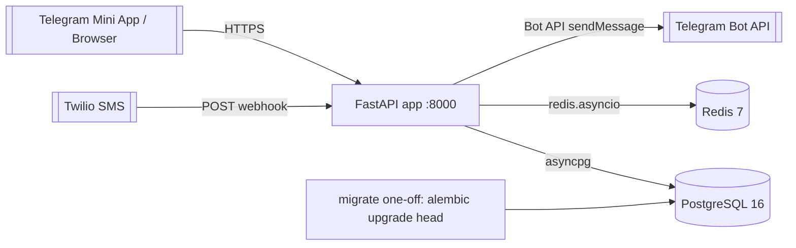
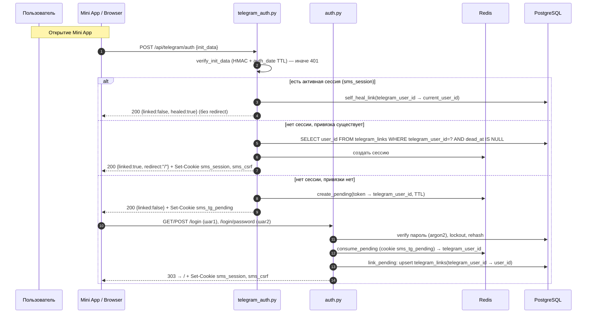

# 03. Architecture

## Обзор

Монолитное FastAPI-приложение + фоновый loop доставки внутри того же процесса. Отдельный worker-процесс не вводится (объём мал, см. NFR в [01-overview.md](./01-overview.md)). Данные — PostgreSQL, эфемерное состояние (сессии, pending-токены, rate-limit) — Redis.

## Топология развёртывания



Один бот обслуживает и Mini App-логин, и push-доставку (в отличие от нескольких ботов mail-agregator). Long polling и `/start`-подписка удалены (см. [ADR-0005](./adr/ADR-0005-sms-addressing-via-team.md)).

## Пакеты и слои

```
shared/                      # переносимый инфраструктурный слой
  config.py                  # pydantic-settings Settings
  db.py                      # Base(DeclarativeBase), init_engine(role), get_session, make_session, dispose_engine
  models/                    # SQLAlchemy-модели: teams, users, telegram_links, phone_numbers,
                             #   inbound_sms, deliveries, admin_audit, service_state
migrations/                  # Alembic (env.py async, versions/)
app/
  api/
    deps.py                  # DbSession, current_session/current_user, VisibilityScope, guards
    cookies.py, csrf.py      # cookie-хелперы, CSRF double-submit
    middlewares.py           # CSRF, MethodOverride, Session, SecurityHeaders, RequestID
    templates.py             # Jinja2 env
    templates/               # base, login, login_password, set_password, admin/*, errors/*
    static/js/               # tg.js, csrf.js, admin_users.js ; static/css/main.css
    routers/
      webhooks.py            # POST /api/webhooks/twilio/sms
      auth.py                # /login, /login/password, /set-password, /logout
      telegram_auth.py       # POST /api/telegram/auth (Mini App SSO)
      admin.py               # /api/admin/users, /api/admin/teams, /api/admin/teams/{id}/leader (set_leader)
      admin_ui.py            # GET /admin, /admin/teams (SSR)
      numbers.py             # /api/numbers CRUD
  application/
    services.py              # SMS-пайплайн (handle_incoming_sms, deliver, retry)
    auth_service.py          # seed_admin, lookup_for_login, login, complete_set_password, logout
    admin_service.py         # create_user, reset_password, delete_user
    teams_service.py         # create/rename/delete, set_leader, «первый=лидер»
    telegram_sso_service.py  # verify_and_resolve, create/consume_pending, link_pending, self_heal_link, mark_link_dead
    workers.py               # delivery_retry_loop
  domain/
    entities.py              # Team, User, Recipient, PhoneNumber, InboundSms, Delivery, TelegramLink
    repositories.py          # async-протоколы репозиториев
  infrastructure/
    repositories.py          # реализации на AsyncSession
    sessions.py              # SessionStore + SetupSessionStore (Redis)
    rate_limit.py            # счётчики попыток/лимитов (Redis)
    redis_client.py          # redis.asyncio singleton
    telegram_api.py          # Bot API client + TelegramForbiddenError/TelegramApiError
    twilio_security.py       # RequestValidator обёртка
  core/
    security.py              # argon2 singleton (hash/verify/needs_rehash)
  telegram/
    init_data.py             # verify_init_data() — HMAC-SHA256 + auth_date TTL
scripts/
  migrate_sqlite_to_pg.py    # one-off миграция данных
```

## Порядок middleware

Регистрируются в `create_app` в обратном порядке (`app.add_middleware` добавляет наружу), итоговая цепочка обработки запроса:

```
CSRF → MethodOverride → Session → SecurityHeaders → RequestID
```

- **RequestID** (внутренний) — присваивает `X-Request-ID`, кладёт в `request.state` и логи.
- **SecurityHeaders** — CSP, `X-Content-Type-Options`, `Referrer-Policy` и др. (см. [08-security.md](./08-security.md)).
- **Session** — читает cookie `sms_session`, резолвит сессию из Redis в `request.state.session`.
- **MethodOverride** — поддержка `_method=DELETE/PATCH` из HTML-форм (SSR без JS-фетча).
- **CSRF** (внешний) — проверка double-submit токена для небезопасных методов; endpoints webhook и `/api/telegram/auth` — в exempt-списке (защита — подпись Twilio / HMAC initData).

## Доступ к БД и сессии

- `shared/db.py`: `Base(DeclarativeBase)`, `init_engine(role)` создаёт async engine с пулом по роли (`api`: pool_size=10, max_overflow=20; `worker`: 5/5), `pool_pre_ping=True`. `get_session()` — dependency (FastAPI `Depends`), `make_session()` — контекстный менеджер для фоновых задач/скриптов. `dispose_engine()` в shutdown.
- Webhook-обработчик выполняет одну сессию/транзакцию на запрос.
- Циклический FK `teams.leader_user_id ↔ users.team_id` разрешается через `users.team_id DEFERRABLE INITIALLY DEFERRED` (проверка откладывается до COMMIT) — см. [04-data-model.md](./04-data-model.md).

### Работа с транзакциями и autobegin (нормативно)

Session factory сконфигурирована с `expire_on_commit=False`, поэтому ORM-атрибуты остаются доступны **после** `commit()` (не требуют повторной загрузки). SQLAlchemy работает в режиме **autobegin**: первый же `SELECT` (read) неявно открывает read-транзакцию. Эту транзакцию **обязательно закрыть** (`await session.commit()`) перед началом явного write-блока `async with session.begin()`, иначе — `InvalidRequestError: A transaction is already begun`.

Правило: если после read-запроса нужен write-блок в той же сессии — сначала `commit()` read-транзакции, затем `session.begin()`.

```python
number = await phones.find_by_phone(to)      # autobegin: открыл read-tx
await session.commit()                        # ОБЯЗАТЕЛЬНО: закрыть read-tx
async with session.begin():                   # чистый write-блок
    sms = await messages.create(...)
```

Паттерн уже применён в `app/api/deps.py::current_user`, `app/application/services.py` (`handle_incoming_sms`, `retry_pending_deliveries`), `app/api/routers/numbers.py`. Исполнители обязаны следовать ему во всех местах, где read-SELECT предшествует `session.begin()` (первопричина устранённого класса бага — см. [100-known-tech-debt.md](./100-known-tech-debt.md)).

## Поток приёма и рассылки SMS

```mermaid
sequenceDiagram
    autonumber
    participant TW as Twilio
    participant WH as webhooks.py
    participant SVC as services.handle_incoming_sms
    participant DB as PostgreSQL
    participant TG as Telegram Bot API

    TW->>WH: POST /api/webhooks/twilio/sms (form-urlencoded)
    WH->>WH: validate_twilio_signature (если VERIFY_TWILIO_SIGNATURE)
    WH->>SVC: handle_incoming_sms(sid, from, to, body, raw)
    SVC->>SVC: normalize_phone(to/from)
    SVC->>DB: PhoneNumberRepository.find_by_phone(to)
    SVC->>DB: SmsRepository.find_by_sid(sid)  (дедуп ретраев webhook)
    alt дубликат по SID
        Note over SVC: НЕ ранний возврат: переиспользуем существующий inbound_sms
        SVC->>SVC: sms = существующий (по SID), team_id = sms.team_id
    else новое
        SVC->>DB: inbound_sms.create(team_id=phone.team_id | NULL, raw_payload JSONB)
    end
    alt team_id IS NULL (неизвестный номер)
        SVC->>SVC: warning; SMS сохранён, доставок нет
    else team_id найден (и для нового, и для дубликата)
            SVC->>DB: UserRepository.recipients_for_team(team_id)  (join telegram_links dead_at IS NULL)
            loop каждый получатель (user_id, telegram_user_id)
                SVC->>DB: DeliveryRepository.try_reserve(inbound_sms_id, user_id, telegram_user_id)
                Note over SVC,DB: pg_insert ON CONFLICT(inbound_sms_id, telegram_user_id) DO NOTHING RETURNING id
                alt зарезервировано (id вернулся)
                    SVC->>TG: sendMessage(telegram_user_id, format_sms_message)
                    alt успех
                        SVC->>DB: mark_sent
                    else 403 / blocked / chat not found
                        SVC->>DB: mark_dead(delivery) + telegram_links.mark_dead
                    else прочая ошибка
                        SVC->>DB: mark_failed (уйдёт в retry-loop)
                    end
                else уже доставлялось (id пустой)
                    SVC->>SVC: пропуск (идемпотентность)
                end
            end
        end
    WH-->>TW: 200 <Response></Response>
```

`delivery_retry_loop` (в `workers.py`) периодически берёт `status IN (pending, failed)` с `attempts < DELIVERY_MAX_ATTEMPTS`, берёт chat_id из снимка delivery, проверяет живость привязки, повторяет; 403 → dead.

### Восстановимость веерной рассылки при обрыве процесса (нормативно)

NFR «надёжность доставки» требует, чтобы fan-out был **crash-recoverable**: если процесс упал в середине рассылки (часть получателей получила SMS, часть — нет), недоставленные обязаны быть добраны без ручного вмешательства. Требуемое поведение (backend реализует, QA тестирует):

1. **Дедуп-ветка НЕ делает ранний возврат.** При повторном webhook с тем же `MessageSid` обработчик **переиспользует** существующий `inbound_sms` и всё равно проходит полный fan-out: `recipients_for_team(team_id)` → для каждого получателя `try_reserve` + отправка. Уже доставленные отсекаются идемпотентно (UNIQUE `(inbound_sms_id, telegram_user_id)` → `try_reserve` вернёт пусто → пропуск), недоставленные — досылаются. Ранний `return existing_sms` **запрещён** (именно он терял получателей при крэше).
2. **Материализация получателей идемпотентна по снапшоту.** Набор получателей и строки `deliveries` создаются так, что повторный проход (webhook-retry ИЛИ `delivery_retry_loop`) гарантированно добирает пропущенных. Допустимы две эквивалентные реализации:
   - (a) в дедуп/новой ветке всегда вызывать `recipients_for_team` + `try_reserve` на каждого (идемпотентно); либо
   - (b) создавать **все** `pending`-deliveries по снапшоту получателей в одной транзакции **до** первой отправки, затем отправлять; тогда даже при крэше до/во время отправки `delivery_retry_loop` увидит `pending` и дошлёт.
3. **Двойное покрытие.** Недоставленные добираются либо webhook-retry Twilio (дедуп-ветка, п.1), либо `delivery_retry_loop` (для `pending`/`failed`). Оба пути идемпотентны и не создают дублей.

Источник требования — [ADR-0005](./adr/ADR-0005-sms-addressing-via-team.md) §4 (идемпотентность) + §«Восстановимость». Тест-сценарий crash-recovery — [06-testing-strategy.md](./06-testing-strategy.md).

## Поток auth / Telegram Mini App SSO



Первый вход пользователя, созданного админом (`password_hash IS NULL`, `password_reset_required=true`): после шага-1 логина он направляется на `/set-password`; после успешной установки пароля так же выполняется `link_pending`, если есть `sms_tg_pending`.

Полные контракты endpoints — [05-api-contracts.md](./05-api-contracts.md). Детали безопасности — [08-security.md](./08-security.md).

## Что удаляется из текущего кода

- `app/infrastructure/db.py` (sqlite `Database`, глобальный `db`), синхронные `Sqlite*Repository`.
- Long polling: `telegram_polling_loop`, `handle_telegram_command`, `/start`/`/my_projects`/`/numbers`.
- Автогенерация проектов/номеров: `_get_or_create_auto_project`, `ensure_all_users_have_project`, `_ensure_number_mapping`, `upsert_user`.
- `twilio_numbers_sync_loop` — отключается для MVP.
- HTTP Basic / `X-Admin-Token` авторизация admin-API.

Маппинг старых сущностей на новые — [04-data-model.md](./04-data-model.md) §«Маппинг SQLite → PostgreSQL».
