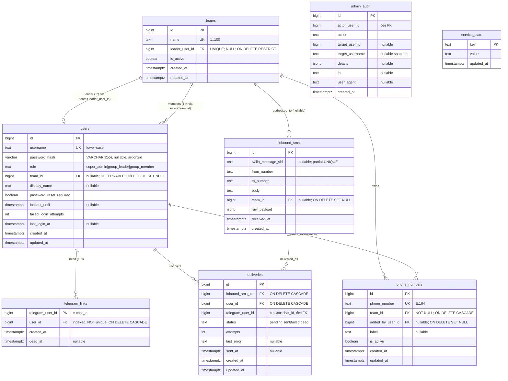

# 04. Data Model

СУБД — **PostgreSQL 16**. Кодировка UTF-8. Все временные поля — `TIMESTAMPTZ` в UTC. Все PK — `BIGINT` (`BIGSERIAL`/identity). JSONB для сырых payload'ов.

Источники решений: [ADR-0001](./adr/ADR-0001-postgres-sqlalchemy-async.md) (стек/схема), [ADR-0003](./adr/ADR-0003-roles-and-teams.md) (роли/команды), [ADR-0004](./adr/ADR-0004-telegram-mini-app-sso.md) (`telegram_links`), [ADR-0005](./adr/ADR-0005-sms-addressing-via-team.md) (адресация), [ADR-0006](./adr/ADR-0006-data-migration-sqlite-to-pg.md) (миграция).

Общие конвенции: `created_at`/`updated_at` — `TIMESTAMPTZ NOT NULL DEFAULT now()`; триггер `set_updated_at()` (BEFORE UPDATE) обновляет `updated_at`; частичные индексы по `is_active`/`dead_at`.

## ER-диаграмма



---

## Таблицы

### `teams` (было: `projects`)

| Колонка | Тип | Constraints | Описание |
| --- | --- | --- | --- |
| `id` | BIGSERIAL | PK | |
| `name` | TEXT | NOT NULL, UNIQUE, CHECK length 1..100 | Имя команды. |
| `leader_user_id` | BIGINT | NULL, UNIQUE, FK → `users(id)` ON DELETE RESTRICT | Лидер команды. NULL допустим только для «orphan»-команды без участников (сразу после создания, до добавления первого участника). UNIQUE → один user лидирует максимум одной командой. RESTRICT → нельзя удалить пользователя, пока он лидер (сначала переназначить/удалить команду). |
| `is_active` | BOOLEAN | NOT NULL DEFAULT true | |
| `created_at` | TIMESTAMPTZ | NOT NULL DEFAULT now() | |
| `updated_at` | TIMESTAMPTZ | NOT NULL DEFAULT now() | Триггер `set_updated_at()`. |

**Индексы:** UNIQUE(`name`); UNIQUE(`leader_user_id`) (частичный `WHERE leader_user_id IS NOT NULL`).

**Правило «первый=лидер»:** при добавлении первого участника в команду с `leader_user_id IS NULL` — этот участник получает `role='group_leader'` и записывается в `teams.leader_user_id` (см. [ADR-0003](./adr/ADR-0003-roles-and-teams.md), реализация в `teams_service.set_leader_if_absent`).

---

### `users`

| Колонка | Тип | Constraints | Описание |
| --- | --- | --- | --- |
| `id` | BIGSERIAL | PK | |
| `username` | TEXT | NOT NULL, UNIQUE, CHECK `username = lower(username)` | Логин. Нормализуется в lower-case приложением; CHECK — defense-in-depth. Для legacy tg-аккаунтов после миграции — `'tg_'+telegram_id`. |
| `password_hash` | VARCHAR(255) | NULL | argon2id. NULL — пароль ещё не задан (создан админом) или сброшен. |
| `role` | TEXT | NOT NULL DEFAULT `'group_member'`, CHECK IN (`super_admin`,`group_leader`,`group_member`) | Роль. `seed_admin` upsert'ит `super_admin`. |
| `team_id` | BIGINT | NULL, FK → `teams(id)` ON DELETE SET NULL, **DEFERRABLE INITIALLY DEFERRED** | Команда пользователя. Multi-team не вводится. DEFERRABLE — из-за циклического FK с `teams.leader_user_id` (создание лидера: INSERT user → INSERT/UPDATE team → UPDATE user.team_id, проверка FK откладывается до COMMIT). |
| `display_name` | TEXT | NULL, CHECK length 1..100 | Человекочитаемое имя для UI; fallback на `username`. |
| `password_reset_required` | BOOLEAN | NOT NULL DEFAULT true | true после seed/create/reset; false после `set-password`. |
| `lockout_until` | TIMESTAMPTZ | NULL | Если > now() — login отклоняется (см. [08-security.md](./08-security.md)). |
| `failed_login_attempts` | INT | NOT NULL DEFAULT 0 | Сброс при успехе/истечении lockout. |
| `last_login_at` | TIMESTAMPTZ | NULL | |
| `created_at` | TIMESTAMPTZ | NOT NULL DEFAULT now() | |
| `updated_at` | TIMESTAMPTZ | NOT NULL DEFAULT now() | Триггер `set_updated_at()`. |

**CHECK-инварианты:**
- `users_role_check` — `role IN ('super_admin','group_leader','group_member')`.
- `users_role_team_invariant` — табличный CHECK:
  ```sql
  CHECK (
      (role = 'super_admin'  AND team_id IS NULL) OR
      (role = 'group_leader' AND team_id IS NOT NULL) OR
      (role = 'group_member' AND team_id IS NOT NULL)
  )
  ```
- `users_username_lower_check` — `username = lower(username)`.
- `users_display_name_length_check` — `display_name IS NULL OR char_length(display_name) BETWEEN 1 AND 100`.

**Индексы:** UNIQUE(`username`); **`UNIQUE INDEX users_single_super_admin ON users ((role)) WHERE role='super_admin'`** — partial-UNIQUE, гарантирует, что в БД существует **не более одного** `super_admin` (инвариант «ровно один админ» — defense-in-depth, не только операционная ответственность); `INDEX (team_id) WHERE team_id IS NOT NULL`.

**`seed_admin` и уникальность super_admin:** `seed_admin()` (при старте) upsert'ит super_admin из `ADMIN_LOGIN`/`ADMIN_PASSWORD`. Чтобы смена `ADMIN_LOGIN` не создала **второго** super_admin: seed сначала ищет **существующего** `super_admin` (по partial-индексу выше). Если он есть и его `username` отличается от `ADMIN_LOGIN` — seed **переименовывает** существующую строку (UPDATE `username`, `password_hash`), а не вставляет новую. Если строки нет — INSERT. Partial-UNIQUE индекс — страховка: попытка вставить второго super_admin падает на уровне БД. Детали seed-логики — [08-security.md](./08-security.md) §1.

**Триггер лидерства (defense-in-depth, `users_team_leader_consistency_check`):** AFTER INSERT OR UPDATE OF `role`,`team_id`, DEFERRABLE INITIALLY DEFERRED — при `role='group_leader'` гарантирует существование `teams` с `id = users.team_id` И `leader_user_id = users.id`. Backend валидирует до SQL для понятных кодов ошибок.

---

### `telegram_links`

Источник — [ADR-0004](./adr/ADR-0004-telegram-mini-app-sso.md). Связка Telegram-аккаунта (chat_id) с внутренним `users.id`. Активна пока `dead_at IS NULL`.

| Колонка | Тип | Constraints | Описание |
| --- | --- | --- | --- |
| `telegram_user_id` | BIGINT | PK | Telegram User.id из подписанного initData (= chat_id для приватного чата). PK → атомарный upsert `ON CONFLICT (telegram_user_id) DO UPDATE`. |
| `user_id` | BIGINT | NOT NULL, FK → `users(id)` ON DELETE CASCADE | Внутренний пользователь. **Без UNIQUE** — один user может иметь несколько привязок (1:N, мягкий потолок `TG_MAX_LINKS_PER_USER`). |
| `created_at` | TIMESTAMPTZ | NOT NULL DEFAULT now() | Обновляется при реальной перепривязке/реактивации (см. self-heal в ADR-0004). |
| `dead_at` | TIMESTAMPTZ | NULL | Заполняется при 403/blocked/chat not found от Bot API. Диспетчер пропускает доставку. Обнуляется при следующем успешном `POST /api/telegram/auth` того же tg-user. |

**Индексы:** PK(`telegram_user_id`); `telegram_links_user_id_idx` на `(user_id)` (неуникальный) — для recipient-SQL и форс-отзыва.

---

### `phone_numbers` (было: `twilio_numbers`)

| Колонка | Тип | Constraints | Описание |
| --- | --- | --- | --- |
| `id` | BIGSERIAL | PK | |
| `phone_number` | TEXT | NOT NULL, UNIQUE | Номер в формате E.164 (нормализуется `normalize_phone`). |
| `team_id` | BIGINT | NOT NULL, FK → `teams(id)` ON DELETE CASCADE | Команда-владелец номера. |
| `added_by_user_id` | BIGINT | NULL, FK → `users(id)` ON DELETE SET NULL | Кто добавил (аудит). Любой участник команды. |
| `label` | TEXT | NULL | Ярлык. |
| `is_active` | BOOLEAN | NOT NULL DEFAULT true | |
| `created_at` | TIMESTAMPTZ | NOT NULL DEFAULT now() | |
| `updated_at` | TIMESTAMPTZ | NOT NULL DEFAULT now() | Триггер `set_updated_at()`. |

**Индексы:** UNIQUE(`phone_number`); `INDEX (team_id)`.

---

### `inbound_sms` (было: `inbound_messages`)

| Колонка | Тип | Constraints | Описание |
| --- | --- | --- | --- |
| `id` | BIGSERIAL | PK | |
| `twilio_message_sid` | TEXT | NULL | Twilio `MessageSid`. |
| `from_number` | TEXT | NOT NULL | Нормализованный отправитель. |
| `to_number` | TEXT | NOT NULL | Нормализованный получатель (наш номер). |
| `body` | TEXT | NOT NULL | Текст SMS. |
| `team_id` | BIGINT | NULL, FK → `teams(id)` ON DELETE SET NULL | Команда по номеру-получателю. NULL — неизвестный номер (SMS сохраняется, но не доставляется). |
| `raw_payload` | JSONB | NOT NULL | Полный form-payload webhook (было `raw_payload_json TEXT`). |
| `received_at` | TIMESTAMPTZ | NOT NULL | Время приёма. |
| `created_at` | TIMESTAMPTZ | NOT NULL DEFAULT now() | |

**Constraints:** partial-UNIQUE `(twilio_message_sid) WHERE twilio_message_sid IS NOT NULL` (`inbound_sms_sid_uq`) — дедупликация ретраев webhook. NULL-SID (ручные/тестовые) не конфликтуют.

**Индексы:** partial-UNIQUE выше; `INDEX (received_at DESC)`; `INDEX (team_id) WHERE team_id IS NOT NULL`.

---

### `deliveries` (было: `telegram_deliveries`)

| Колонка | Тип | Constraints | Описание |
| --- | --- | --- | --- |
| `id` | BIGSERIAL | PK | |
| `inbound_sms_id` | BIGINT | NOT NULL, FK → `inbound_sms(id)` ON DELETE CASCADE | |
| `user_id` | BIGINT | NOT NULL, FK → `users(id)` ON DELETE CASCADE | Получатель-владелец. |
| `telegram_user_id` | BIGINT | NOT NULL | Снимок chat_id на момент доставки. **Без FK** (реестр переживает удаление/перепривязку линка). |
| `status` | TEXT | NOT NULL DEFAULT `'pending'`, CHECK IN (`pending`,`sent`,`failed`,`dead`) | `pending`→`sent`/`failed`/`dead`. `failed` ретраится; `dead` — нет (403/blocked). |
| `attempts` | INT | NOT NULL DEFAULT 0 | Инкремент при каждой попытке. |
| `last_error` | TEXT | NULL | Усечённое описание ошибки (без секретов, ≤1000). |
| `sent_at` | TIMESTAMPTZ | NULL | Время успешной доставки. |
| `created_at` | TIMESTAMPTZ | NOT NULL DEFAULT now() | |
| `updated_at` | TIMESTAMPTZ | NOT NULL DEFAULT now() | Триггер `set_updated_at()`. |

**Constraints:** UNIQUE `(inbound_sms_id, telegram_user_id)` (`deliveries_sms_chat_uq`) — идемпотентность доставки на конкретный чат. `DeliveryRepository.try_reserve` использует `pg_insert(...).on_conflict_do_nothing().returning(id)`; пустой RETURNING → доставка в этот чат уже была, пропуск.

**Индексы:** UNIQUE выше; `INDEX (status, attempts) WHERE status IN ('pending','failed')` — для retry-loop.

---

### `admin_audit`

| Колонка | Тип | Constraints | Описание |
| --- | --- | --- | --- |
| `id` | BIGSERIAL | PK | |
| `actor_user_id` | BIGINT | NOT NULL | id действующего (обычно super_admin). **Без FK** — запись переживает удаление пользователя. |
| `action` | TEXT | NOT NULL | Enum-string: `admin_login`, `admin_logout`, `create_user`, `reset_password`, `delete_user`, `lockout_triggered`, `team_create`, `team_rename`, `team_delete`, `team_leader_set`, `user_team_change`, `number_added`, `number_removed`, `telegram_link_created`, `telegram_link_revoked`, `telegram_link_dead_marked`, `telegram_link_rebound`. |
| `target_user_id` | BIGINT | NULL | Затронутый пользователь. |
| `target_username` | TEXT | NULL | Снимок username (на случай delete). |
| `details` | JSONB | NULL | Структурированные детали (`{telegram_user_id, team_id, phone_number, ...}`). |
| `ip` | TEXT | NULL | IP инициатора. |
| `user_agent` | TEXT | NULL | Усечён до 256. |
| `created_at` | TIMESTAMPTZ | NOT NULL DEFAULT now() | |

**Индексы:** `INDEX (created_at DESC)`; `INDEX (actor_user_id, created_at DESC)`; `INDEX (target_user_id) WHERE target_user_id IS NOT NULL`. Ретенция — бессрочная (объём ничтожен).

---

### `service_state`

Без изменений относительно SQLite (кроме типа времени).

| Колонка | Тип | Constraints | Описание |
| --- | --- | --- | --- |
| `key` | TEXT | PK | Ключ. |
| `value` | TEXT | NOT NULL | Значение. |
| `updated_at` | TIMESTAMPTZ | NOT NULL DEFAULT now() | |

`StateRepository.set` — `pg_insert(...).on_conflict_do_update(index_elements=['key'], ...)`.

---

## Триггеры и функции

- `set_updated_at()` — `RETURNS trigger`, ставит `NEW.updated_at = now()`. BEFORE UPDATE на `teams`, `users`, `phone_numbers`, `deliveries`.
- `users_team_leader_consistency_check()` — constraint-триггер лидерства (см. `users`).
- Все создаются в initial-миграции Alembic; `downgrade` обратимо их удаляет.

## Alembic

- `alembic.ini`, `migrations/env.py` (async engine, `import shared.models`, `target_metadata = Base.metadata`, `compare_type=True`).
- `migrations/versions/<rev>_initial_schema.py` — все таблицы, FK (с DEFERRABLE где указано), CHECK, UNIQUE, partial-индексы, триггеры/функции; обратимый `downgrade`.
- Требование: `alembic revision --autogenerate` после применения даёт **пустой** diff (см. [06-testing-strategy.md](./06-testing-strategy.md)).

---

## Маппинг SQLite → PostgreSQL

Полный алгоритм — [ADR-0006](./adr/ADR-0006-data-migration-sqlite-to-pg.md); скрипт `scripts/migrate_sqlite_to_pg.py`.

| SQLite (старое) | PostgreSQL (новое) | Примечания |
| --- | --- | --- |
| `projects` | `teams` | `name`→`name`, `description` отбрасывается (нет колонки; при необходимости → `Q`). `leader_user_id` проставляется на шаге лидеров. |
| `telegram_users` | `users` + `telegram_links` | `users.username='tg_'+telegram_id`, `password_hash=NULL`, `role='group_member'`. `telegram_links(telegram_user_id=telegram_id, user_id=new_id, dead_at=now() если !is_active)`. Маппинг `old telegram_users.id → new user_id`. |
| `user_project_access` | `users.team_id` | Единственный проект → его команда; несколько → первый; осиротевшие (0 проектов) → служебная команда `Legacy` (`--orphan-team-name`). Multi-team не переносится (лишние доступы теряются — фиксируется в отчёте). |
| — (нет) | `teams.leader_user_id` | Лидер = `min(user_id)` среди участников команды; ему `role='group_leader'`. |
| `twilio_numbers` | `phone_numbers` | `team_id←project_id`, `added_by_user_id←leader`. |
| `inbound_messages` | `inbound_sms` | `team_id←project_id`, `raw_payload_json::jsonb`→`raw_payload`. `twilio_message_sid` сохраняется (partial-UNIQUE). |
| `telegram_deliveries` | `deliveries` | `inbound_message_id→inbound_sms_id`; `telegram_user_id` (старое = FK на telegram_users.id) → через маппинг в `deliveries.user_id` + снимок chat_id в `deliveries.telegram_user_id`. UNIQUE dedup. |
| `service_state` | `service_state` | 1:1, кроме `telegram_offset` (long polling удалён). |

**Инварианты после миграции:** у каждой непустой команды ровно один `group_leader`; нет `group_member`/`group_leader` с `team_id IS NULL`; повторный прогон скрипта не создаёт дублей (`ON CONFLICT DO NOTHING`, сохранение id, `setval` sequences).

> `Q-DATA-1` (см. [99-open-questions.md](./99-open-questions.md)): сохранять ли `projects.description` (добавить `teams.description`)? По умолчанию — не сохранять (в текущем UI не используется).
